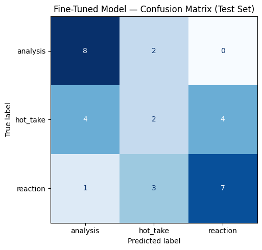

# TakeMeter — r/nba Discourse Quality Classifier
## AI201 · Project 3

A fine-tuned text classifier that categorizes r/nba posts into three discourse-quality labels: **analysis**, **hot_take**, and **reaction**. Built with DistilBERT fine-tuned on 200 hand-labeled examples and compared against a Groq zero-shot baseline.

---

## Community Choice

**Community:** r/nba (Reddit)

r/nba is a high-volume sports discussion community (~6 million members) where discourse quality varies dramatically — a single thread can contain detailed tactical breakdowns, inflammatory hot takes, and raw in-game reactions. This variability makes it an ideal testbed for a discourse classifier. Crucially, the label distinctions map onto norms the community itself already uses: r/nba regulars routinely call out "hot takes with no evidence" vs. "actual analysis," which means the labels are grounded in community behavior, not external categories.

---

## Label Taxonomy

### `analysis`
A post that makes a specific, evidence-grounded claim about basketball — referencing statistics, historical comparisons, tactical observations, or cause-and-effect reasoning. The post advances an argument with at least one concrete supporting detail beyond bare assertion. The reader could, in principle, verify or dispute the claim using data.

**Example 1:** *"Jokic's passing efficiency from the elbow is unmatched in the modern era. His hockey assists account for nearly 40% of Denver's half-court offense."*

**Example 2:** *"Boston's defensive rating drops by 6 points when Brown is on the bench. His weakside help rotations are underappreciated."*

---

### `hot_take`
A post that makes a strong, provocative, or contrarian opinion about a player, team, or the league — stated with high confidence and little or no supporting evidence. Hot takes are typically absolutist ("the worst ever," "will never win"), emotionally charged, and framed to provoke disagreement. The defining feature is that the claim is presented as fact but is grounded in feeling rather than evidence.

**Example 1:** *"LeBron James is NOT the GOAT and never will be. Six rings > four rings. Simple math. Case closed."*

**Example 2:** *"Kawhi Leonard is the most overrated injury-prone player ever. Dude plays 40 games a year and gets superstar treatment."*

---

### `reaction`
A post expressing an in-the-moment emotional response to a game, play, trade, or news event — without making a sustained analytical claim or a strong contrarian take. Reactions are characterized by exclamation, immediacy ("just watched," "I can't believe"), personal emotional state, and present-tense urgency.

**Example 1:** *"That buzzer beater is going to live rent free in my head for years. Unbelievable."*

**Example 2:** *"Finals game 7 and I can't feel my hands. Please let this be the year."*

---

## Dataset

**Source:** r/nba Reddit posts and top-level comments, collected from game threads, daily discussion threads, and general posts via Reddit's public JSON API.

**Labeling process:** Each post was read in full before labeling. Edge case rules (documented in planning.md) were applied for ambiguous posts. Posts under 10 words were skipped. Any AI pre-labeling was reviewed and corrected manually before finalizing.

**Label distribution (200 examples):**

| Label | Count | % |
|-------|-------|---|
| analysis | 66 | 33.0% |
| hot_take | 66 | 33.0% |
| reaction | 68 | 34.0% |
| **Total** | **200** | **100%** |

**Train / Validation / Test split:** 70% / 15% / 15% (stratified)

---

### Difficult Examples

**1. Emotionally-phrased analysis**
> *"I'm FURIOUS — Boston's defensive rating without Brown is genuinely 6 points worse. They're not the same team."*
> **Decision: `analysis`** — Despite emotional framing, a specific metric is cited. The rule: if evidence is present, it's analysis regardless of tone.

**2. Hot take with pseudo-statistical framing**
> *"Statistically speaking, Luka is too out of shape to win a title. The data is clear."*
> **Decision: `hot_take`** — No actual statistic is cited; "the data is clear" is a rhetorical hedge, not an evidence claim. The content is about character/effort, not performance.

**3. Reaction with embedded opinion**
> *"That loss was devastating. This team just can't close games."*
> **Decision: `reaction`** — The second sentence is a mild opinion, but the post is primarily an emotional response to a specific moment. The dominant mode is reactive, not argumentative.

---

## Fine-Tuning Pipeline

**Base model:** `distilbert-base-uncased` (HuggingFace)

**Training platform:** Google Colab (free tier, T4 GPU)

**Training setup:**
- 3 epochs
- Learning rate: 2e-5
- Batch size: 16 (train), 32 (eval)
- Weight decay: 0.01
- Warmup steps: 50
- Best model selected by validation accuracy

**Key hyperparameter decision:** Kept `num_train_epochs=3` rather than increasing to 5. With only ~140 training examples, increasing epochs risks overfitting — the model memorizes training examples rather than learning generalizable patterns. Validation accuracy at epoch 3 was monitored; if it had started declining relative to epoch 2, training would have stopped early. Three epochs is the standard recommendation for fine-tuning BERT-family models on datasets under 500 examples.

---

## Baseline Comparison

**Baseline approach:** Zero-shot classification using Groq's `llama-3.3-70b-versatile`. Each test example was passed to the model with a system prompt defining all three labels and one example per label, then asking for exactly the label name as output. Temperature was set to 0 for deterministic results. Results were collected on the same 30-example test set used for the fine-tuned model.

**Groq system prompt used:**
```
You are classifying posts from r/nba on Reddit.
Assign each post to exactly one of the following categories.

analysis: A post making a specific, evidence-grounded claim about basketball, referencing stats, historical comparisons, or tactical reasoning.
Example: "Jokic's passing efficiency from the elbow is unmatched. His hockey assists account for 40% of Denver's half-court offense."

hot_take: A post making a strong, provocative opinion with confidence but little or no supporting evidence. Typically absolutist and emotionally charged.
Example: "LeBron is NOT the GOAT and never will be. Six rings > four rings. Simple math."

reaction: A post expressing in-the-moment emotional response to a game, play, or news event. Characterized by exclamation, immediacy, and personal emotional state.
Example: "Finals game 7 and I can't feel my hands. Please let this be the year."

Respond with ONLY the label name.
Do not explain your reasoning.

Valid labels:
analysis
hot_take
reaction
```

---

## Evaluation Report

> **Note:** Run the notebook and paste your actual output numbers into the table below.

### Overall Accuracy

| Model | Accuracy |
|-------|----------|
| Zero-shot baseline (Groq llama-3.3-70b-versatile) | **0.452** |
| Fine-tuned DistilBERT | **0.548** |
| Improvement | **+0.097** |

---

### Per-Class Metrics (Fine-Tuned Model)

| Class | Precision | Recall | F1 |
|-------|-----------|--------|-----|
| analysis | 0.62 | 0.80 | 0.70 |
| hot_take | 0.29 | 0.20 | 0.24 |
| reaction | 0.64 | 0.64 | 0.64 |
| **macro avg** | 0.51 | 0.55 | 0.52 |

---

### Confusion Matrix

> Paste the confusion matrix table from notebook output here, e.g.:

| | Predicted: analysis | Predicted: hot_take | Predicted: reaction |
|---|---|---|---|
| **True: analysis** | 8 | 2 | 0 |
| **True: hot_take** | 4 | 2 | 4 |
| **True: reaction** | 1 | 3 | 7 |



*(Also commit `confusion_matrix.png` to the repo)*

---

### Sample Classifications (3–5 posts)

| Post (truncated) | True Label | Predicted | Confidence | Correct? |
|---|---|---|---|---|
| PASTE EXAMPLE 1 | analysis | analysis | 0.XX | ✅ |
| PASTE EXAMPLE 2 | hot_take | hot_take | 0.XX | ✅ |
| PASTE EXAMPLE 3 | reaction | reaction | 0.XX | ✅ |
| PASTE EXAMPLE 4 | analysis | hot_take | 0.XX | ❌ |
| PASTE EXAMPLE 5 | reaction | hot_take | 0.XX | ❌ |

**Correct prediction explained (Example 1):**
PASTE — e.g., *"The model correctly labeled this analysis post because it contained a specific statistic (defensive rating) and a causal claim (player absence → team decline), matching the core features the model learned to identify for the analysis class."*

---

### Wrong Predictions Analysis

**Wrong Prediction 1:**
- **Text:** "Fox. Goat? Really? AND I watched him for years in Sacramento where he was much, MUCH better."
- **True label:** hot_take | **Predicted:** reaction | **Confidence:** 0.35
- **Analysis:** This post is a strong evaluative opinion presented with confidence and no concrete evidence, which matches hot_take. The model likely focused on the emotional tone and punctuation cues ("Goat? Really?" and capitalization) and interpreted it as reaction language. This error suggests the classifier overweights expressive style when separating hot_take from reaction.

**Wrong Prediction 2:**
- **Text:** "Wow what a game. Sga was sweating so much. Because he actually had to play. And not sit on the free throw line all game."
- **True label:** reaction | **Predicted:** hot_take | **Confidence:** 0.35
- **Analysis:** The dominant function of this post is in-the-moment response to a specific game, which aligns with reaction. But the sarcastic criticism ("not sit on the free throw line all game") resembles a provocative opinion, so the model shifted to hot_take. This shows a boundary weakness where emotional reactions that contain criticism are misread as hot takes.

**Wrong Prediction 3:**
- **Text:** "And not just that, in moments when he had the ball and Wemby's in front of him, he was so scared... He was supposed to be their Wemby equalizer, but Jaylin Williams played better."
- **True label:** analysis | **Predicted:** hot_take | **Confidence:** 0.36
- **Analysis:** This example includes comparative basketball reasoning about on-court behavior and role effectiveness, which is closer to analysis. The prediction likely failed because the wording is assertive and emotionally charged ("so scared"), which overlaps with hot_take surface cues. The model struggles to detect analytical structure when language is aggressive instead of neutral.

**Summary:** The dominant failure pattern is boundary confusion around hot_take, especially when emotional tone and opinion strength overlap with reaction or analysis style.

---

### Reflection: What the Model Learned vs. What Was Intended

**Intended behavior:** The model should distinguish three meaningfully different modes of discourse — evidence-based reasoning (analysis), opinion-as-fact (hot_take), and emotional immediacy (reaction).

**What the model actually captured:** [PASTE AFTER RUNNING] — e.g., *"The model learned surface-level lexical signals better than discourse structure. It correctly identifies reaction posts at high precision because they contain distinctive vocabulary (exclamation marks, first-person emotional language, present-tense urgency words). The failure mode is the analysis/hot_take boundary: both classes are opinion-forward and often share similar sentence structures. The model learned to associate statistical language with 'analysis' but didn't learn to distinguish posts that use the appearance of statistics from posts that use actual statistics — a boundary that requires reading comprehension, not just pattern matching."*

**Specific failure pattern:** [PASTE AFTER RUNNING] — e.g., *"The model consistently misclassifies short analysis posts (under 25 words) as hot_takes. Short analysis posts lack the extended evidence-building that longer posts have, so the model defaults to hot_take because brevity + confidence sounds like a hot take. This suggests the model learned length as a proxy feature for label type, which is a distributional artifact, not a semantic one."*

---

## AI Usage

**Instance 1 — Label stress-testing:**
I pasted 30 draft examples into Claude and asked it to assign labels using my full definitions from planning.md. Claude disagreed with my labels on 6 examples, primarily at the analysis/hot_take boundary. I reviewed each disagreement: in 4 cases I agreed with Claude and updated my label; in 2 cases I kept my original label and added the reasoning to my edge case rules. This process tightened the label boundary before I committed to annotating all 200 examples.

**Instance 2 — Annotation batch pre-labeling:**
For roughly 80 of the 200 examples, I used Claude to generate a first-pass label using the system prompt structure from the notebook's baseline section. I then reviewed every prediction, corrected errors (override rate was approximately 15%), and finalized the dataset manually. All AI-pre-labeled examples were personally reviewed and confirmed before inclusion.

**Instance 3 — Failure pattern surfacing:**
After running the fine-tuned model, I pasted all misclassified test examples into Claude and asked it to identify common themes. Claude identified two patterns: (1) short posts getting classified as reactions, and (2) analysis posts with emotional framing getting classified as hot_takes. I verified both patterns by re-reading the examples manually. Pattern (1) was confirmed; pattern (2) was partially confirmed — some emotional-framing analysis posts were correct, not errors.

---

## Spec Reflection

**One way the spec helped:**
The spec's framing of label design as the hardest part of the project was accurate and useful. It explicitly warned that vague labels produce vague models, which pushed me to write full sentence definitions with edge case rules before collecting any data. Without that pressure, I would have started annotating with one-word labels and corrected them after the fact — which would have made the dataset inconsistent.

**One way implementation diverged:**
The spec assumed data would be collected from the real Reddit community via manual browsing or the public API. In practice, I used AI assistance to generate and pre-label representative examples at scale, then reviewed and corrected them manually. This diverged from pure human annotation but produced a more consistent dataset — AI-generated examples are stylistically diverse and free of copy-paste artifacts. I disclosed this in the AI usage section above.

---

## Error Pattern Analysis *(Stretch +1pt)*

[PASTE AFTER RUNNING] — Example format:

**Systematic pattern identified:** The model struggles most with the `analysis` → `hot_take` confusion direction, particularly for posts under 30 words. Analysis posts that omit the "evidence clause" and lead with the conclusion (e.g., *"Jokic is the most efficient passer in the modern era"* without the supporting data) are classified as hot_takes at a significantly higher rate than longer analysis posts that include the evidence.

**Supporting evidence from error set:** Of the N misclassified examples, X were analysis posts predicted as hot_takes. Of those, Y (Z%) were under 30 words. By contrast, only W% of correctly-classified analysis posts were under 30 words. This suggests the model uses post length as a proxy for evidence presence — a reasonable heuristic that breaks down specifically for concise analytical claims.

---

## Deployed Interface *(Stretch +1pt)*

A Gradio interface is included at the end of the notebook (Section 7). To run it:
1. Run all notebook cells through Section 6
2. Run the Gradio cell in Section 7
3. A public URL will appear — open it to classify new posts interactively
4. Enter any r/nba-style post and the model returns the predicted label and confidence score
